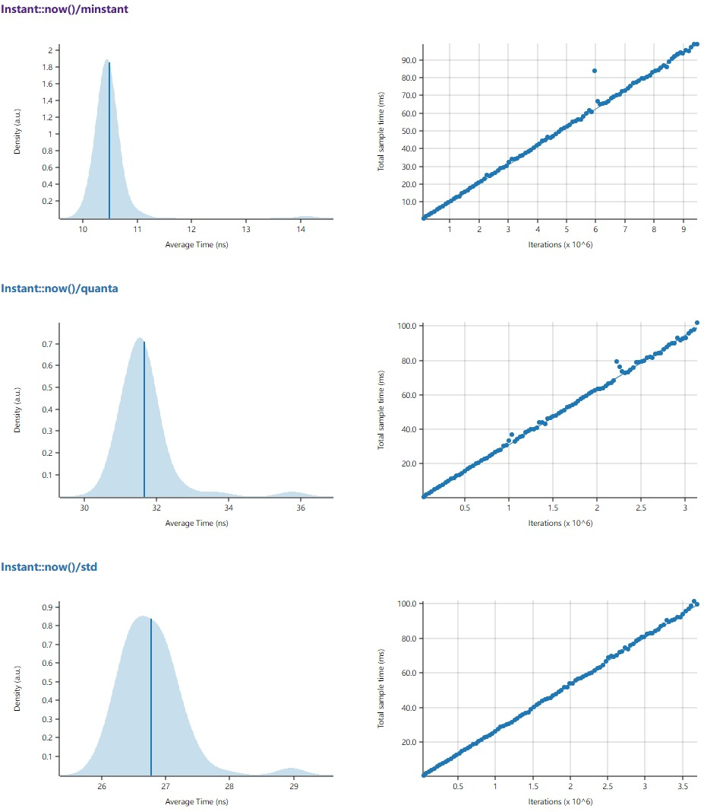

# minstant
[](https://github.com/tikv/minstant/actions)
[](https://travis-ci.org/tikv/minstant)
[](https://docs.rs/minstant/)
[](https://crates.io/crates/minstant)
[](https://github.com/tikv/minstant/blob/master/LICENSE)

A drop-in replacement for [`std::time::Instant`](https://doc.rust-lang.org/std/time/struct.Instant.html) that measures time with high performance and high accuracy powered by [TSC](https://en.wikipedia.org/wiki/Time_Stamp_Counter).

## Usage

```toml
[dependencies]
minstant = "0.1"
```

```rust
let start = minstant::Instant::now();

// Code snipppet to measure

let duration: std::time::Duration = start.elapsed();
```


## Motivation

This library is used by a high performance tracing library [`minitrace-rust`](https://github.com/tikv/minitrace-rust). The main purpose is to use [TSC](https://en.wikipedia.org/wiki/Time_Stamp_Counter) on x86 processors to measure time at high speed without losing much accuracy.

## Platform Support

Currently, only the Linux on `x86` or `x86_64` is backed by [TSC](https://en.wikipedia.org/wiki/Time_Stamp_Counter). On other platforms, `minstant` falls back to `std::time`. If TSC is unstable, it will also fall back to `std::time`.

If speed is privileged over accuracy when fallback occurs, you can use `fallback-corase` feature to use corase time:

```toml
[dependencies]
minstant = { version = "0.1", features = ["fallback-coarse"] }
```

## Benchmark

Benchmark platform is `Intel(R) Xeon(R) CPU E5-2630 v4 @ 2.20GHz` on CentOS 7.

```sh
> cargo criterion

Instant::now()/minstant             time:   [10.449 ns 10.514 ns 10.619 ns]
Instant::now()/quanta               time:   [31.467 ns 31.628 ns 31.822 ns]
Instant::now()/std                  time:   [26.831 ns 26.924 ns 27.016 ns]
minstant::Anchor::new()             time:   [46.987 ns 47.243 ns 47.498 ns]
minstant::Instant::as_unix_nanos()  time:   [15.287 ns 15.318 ns 15.350 ns]
```


